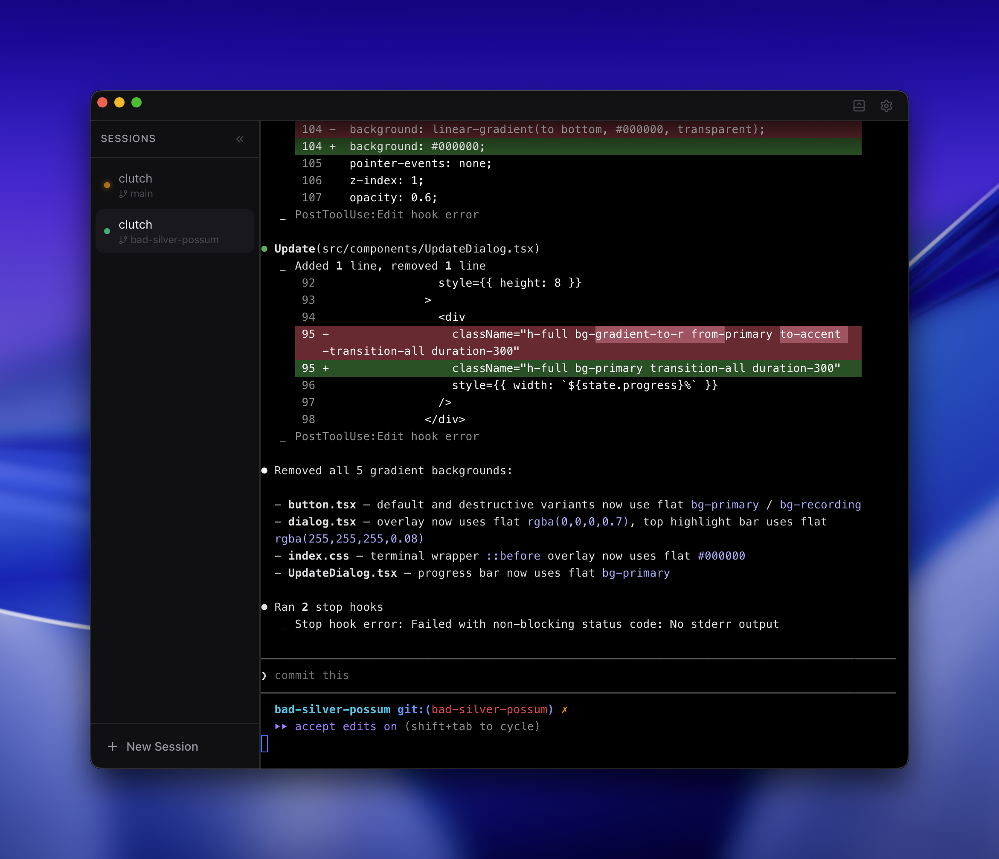

# Clutch

Clutch is a terminal app optimized for running multiple Claude Code sessions.



## Download

[**macOS (Apple Silicon)**](https://github.com/philip-zhan/clutch/releases/latest/download/Clutch_darwin_aarch64.dmg) | [**Linux (.deb)**](https://github.com/philip-zhan/clutch/releases/latest/download/Clutch_linux_amd64.deb) | [**Linux (.AppImage)**](https://github.com/philip-zhan/clutch/releases/latest/download/Clutch_linux_amd64.AppImage) | [**Linux (.rpm)**](https://github.com/philip-zhan/clutch/releases/latest/download/Clutch_linux_x86_64.rpm) | [**Windows**](https://github.com/philip-zhan/clutch/releases/latest/download/Clutch_windows_x64.exe)

## Features

- **Auto worktree management** — Automatically creates and manages git worktrees for each session, keeping your work isolated
- **Notifications** — Get notified when Claude needs your attention
- **Session persistence** — Sessions restore across app restarts
- **Keyboard shortcuts** — `Cmd+T` new session, `Cmd+W` close, `Cmd+1-9` switch, `Cmd+Shift+[/]` navigate

## Development

```bash
bun install
bun run tauri:dev
```

This starts both the Vite dev server and compiles/runs the Rust backend.

### Build

```bash
bun run tauri:build
```

Produces an unsigned `.app` bundle in `src-tauri/target/release/bundle/`.


### Architecture

```
React Frontend (Vite + TypeScript)
├── useSessionStore  — session CRUD + persistence (Tauri plugin-store → sessions.json)
├── usePty           — IPC bridge to Rust PTY commands
├── Terminal          — xterm.js rendering + resize + lifecycle
└── App              — keyboard shortcuts, session orchestration, layout
        ↕ Tauri IPC (invoke / listen)
Rust Backend (src-tauri/)
├── commands.rs      — Tauri command handlers (create/destroy/restart/write/resize)
├── pty.rs           — PTY lifecycle via portable-pty, reader thread → emit events
└── lib.rs           — Plugin registration, tray icon, window hide-on-close
```

**IPC flow**: Frontend calls `invoke("create_session", ...)` → Rust spawns PTY → reader thread emits `pty-data` events → Frontend listens via `listen<PtyDataPayload>("pty-data")` → writes to xterm.js.

**Session lifecycle**: Create (`create_session`) → PTY spawns login shell with optional command → reader thread streams output → on exit emits `pty-exit` → destroy (`destroy_session`) drops the `PtyManager`.


## License

MIT
